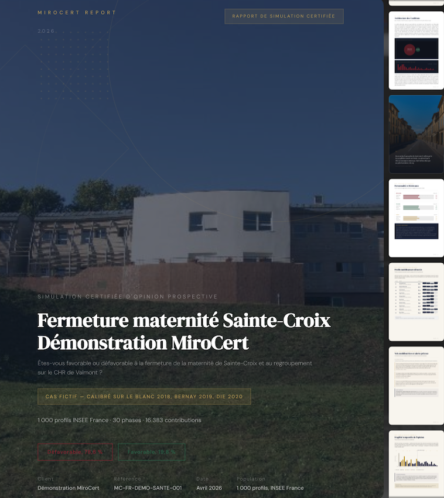
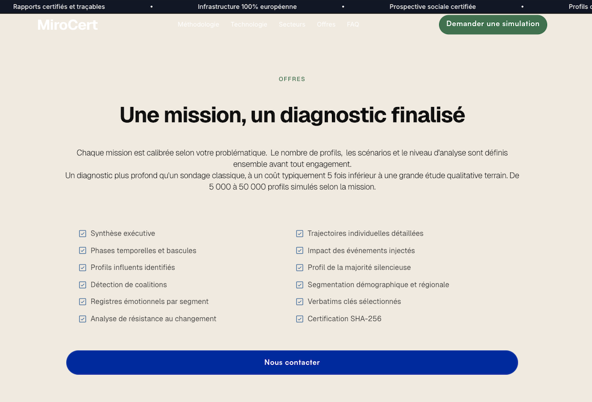
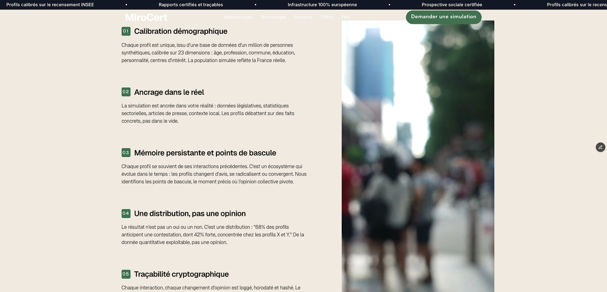
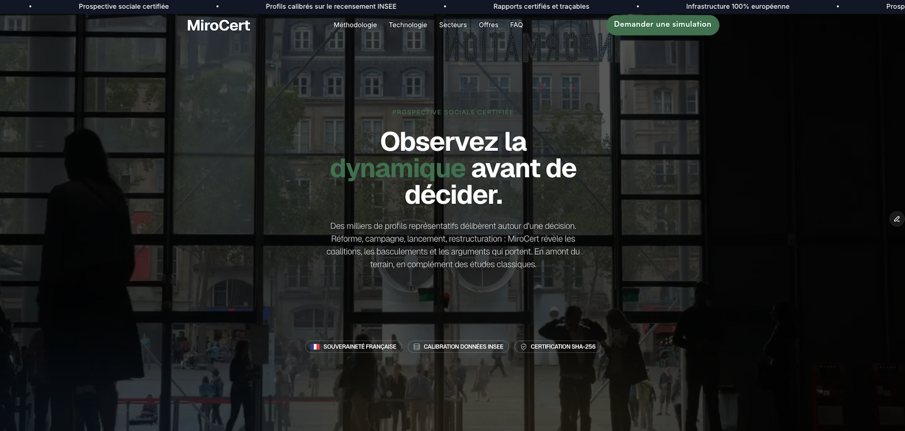

MiroCert — Simulation Certifiée d’Opinion Publique

Plateforme propriétaire qui transforme des simulations brutes en expertises prédictives certifiées et vendables.

Contexte
MiroCert permet à des décideurs (cabinets de conseil, think-tanks, assureurs, avocats) d’obtenir des analyses structurées, traçables et certifiées pour anticiper les réactions collectives face à des décisions stratégiques.

Captures du projet

Points d’architecture forts
- Séparation stricte et non-négociable entre le moteur de simulation open-source (AGPL) et la couche propriétaire
- Certification cryptographique complète des résultats : hash SHA-256, signature ECDSA, horodatage RFC 3161
- Pipeline complet : orchestration → simulation → certification → génération de rapports PDF (30-50 pages)
- Communication sécurisée via API HTTP uniquement
- Infrastructure 100% européenne et souveraine

Stack technique
- Python 3.11+ + FastAPI
- Neo4j (graphe de connaissances)
- Docker Compose + conteneurs isolés
- Certification & traçabilité avancée

Structure du projet
- `src/` → Code propriétaire (API, orchestrator, certification, reporting)
- `infra/docker/` → Moteur de simulation isolé (AGPL)
- `docs/` → Architecture détaillée et décisions techniques

Ce projet démontre ma capacité à concevoir des architectures hybrides sécurisées, respectueuses de contraintes open-source tout en protégeant une valeur métier forte.

Disponible pour démonstration** sur demande.
