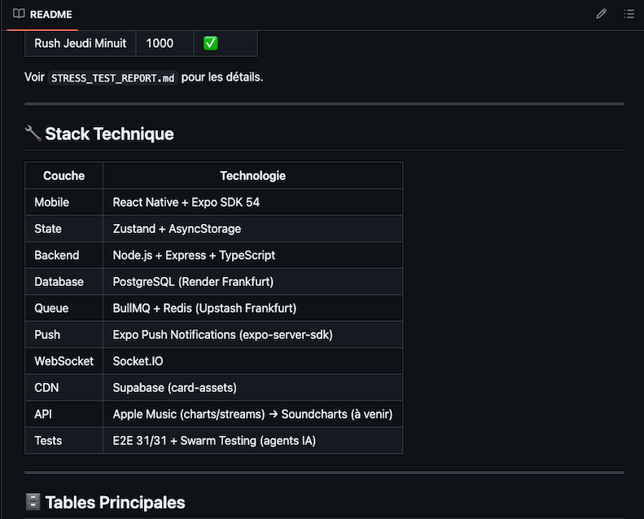
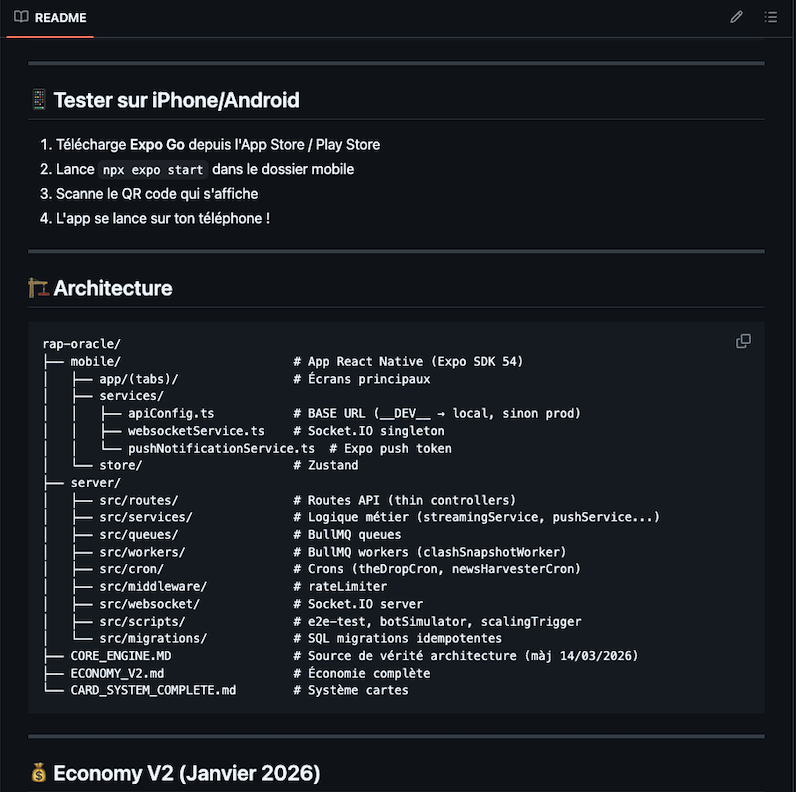

Rap Oracle — Architecture Backend & Moteur Économique Complexe

Plateforme de jeu mobile avec économie dynamique, marketplace P2P et systèmes temps réel.

Contexte
Application mobile de simulation et trading de cartes d’artistes rap français, dotée d’un moteur économique sophistiqué et de mécaniques compétitives (Clash PvP).

Captures du projet

Défis techniques relevés
- Conception d’un moteur économique avancé (pricing dynamique, rareté, dilution logarithmique, multiplicateurs)
- Architecture Double-Bassin (Market + Scouting Pool) avec promotions automatiques
- Système anti-abus complet (rate limiting, cooldowns, optimistic locking)
- Gestion asynchrone avec BullMQ + Redis
- Clash PvP différé avec snapshots et résolution sur données externes
- Synchronisation temps réel (WebSocket + Push Notifications)

Stack technique
- Backend : Node.js + TypeScript, Express, Socket.IO
- Base de données : PostgreSQL
- Queues : BullMQ + Redis (Upstash)
- Storage : Supabase
- Mobile : React Native + Expo, Zustand
- Cron & Harvesting : Apple Music + jobs planifiés

Ce projet illustre ma capacité à concevoir et maintenir des systèmes complexes avec contraintes économiques fortes et scalabilité.

Captures supplémentaires bienvenues dans le dossier `assets/`.
