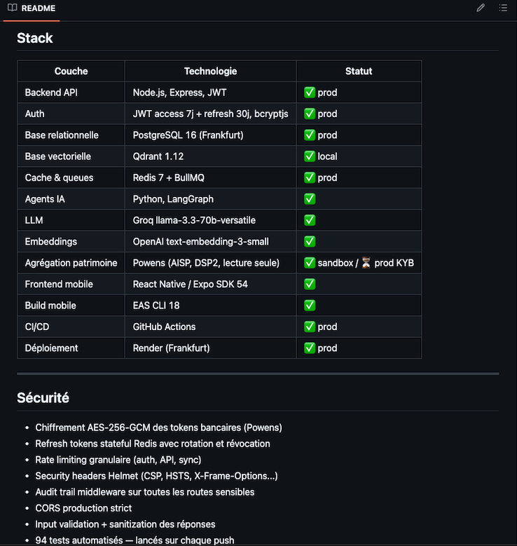
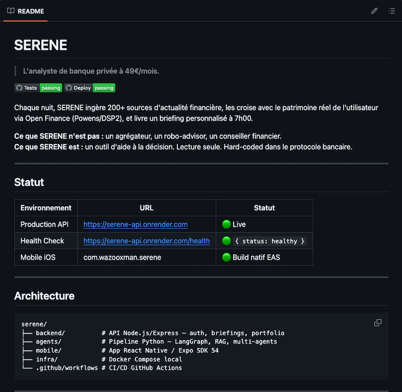

Serene — Intelligence Patrimoniale

Application mobile d’analyse et optimisation patrimoniale avec orchestration avancée.

Contexte
Serene est un outil intelligent qui aide les utilisateurs à suivre, analyser et optimiser leur patrimoine (immobilier, financier, etc.) en croisant de multiples sources de données et en générant des briefings personnalisés.

Captures du projet

Points d’architecture forts
- Pipeline nightly complet (ingestion + analyse + génération de rapports)
- Architecture multi-agents et workflows complexes
- Système d’authentification sécurisé et traçabilité
- Application mobile React Native performante
- CI/CD complet avec tests automatisés

Stack technique
- Backend : Node.js + Express
- Orchestration & Agents : Python + LangGraph
- Mobile : React Native + Expo
- Bases de données : PostgreSQL + Qdrant (vectorielle)
- Queues : Redis + BullMQ
- Déploiement : Render + EAS Build

Ce projet démontre ma capacité à concevoir des systèmes full-stack complexes** combinant backend robuste, pipelines intelligents et application mobile production-ready.

